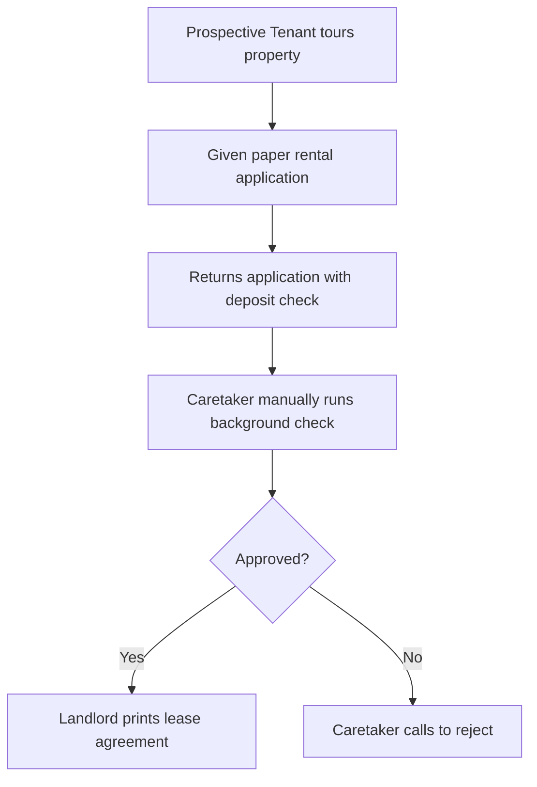
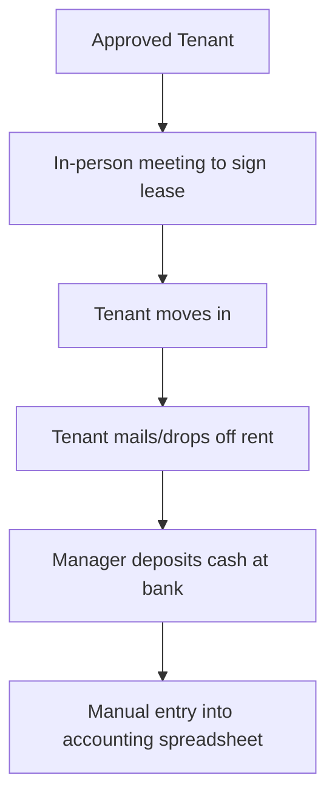
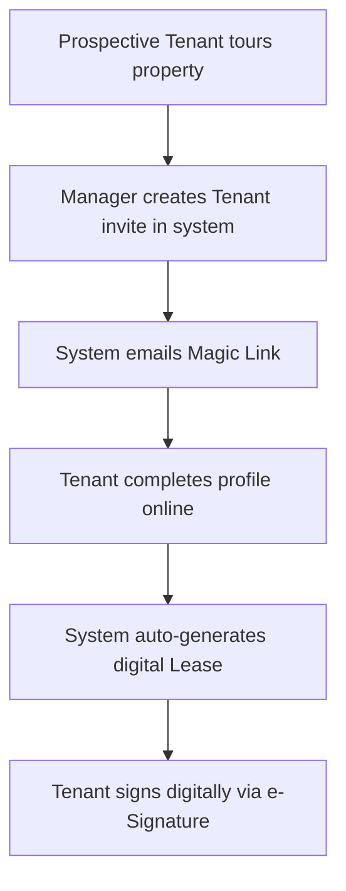
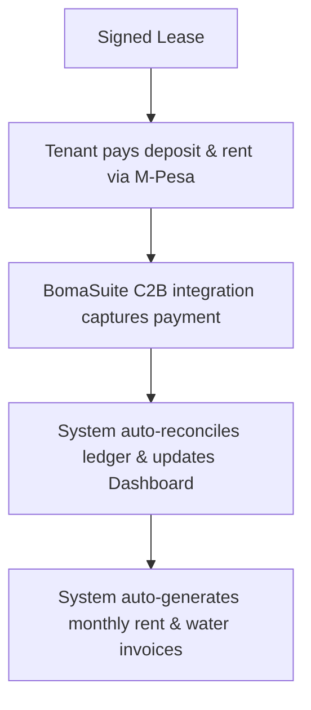

# Process Maps: BomaSuite Property Management

## Current-State Process (Manual Workflow)

### Phase 1: Tenant Onboarding
*Historically, onboarding involved physical application forms, manual background checks, and in-person meetings for lease signing.*

### Phase 2: Move-In & Rent Collection
*Lease signing required in-person coordination, and rent was collected as physical checks or cash, necessitating bank runs and spreadsheet entry.*

## Future-State Process (Automated System)

### Phase 1: Digital Onboarding & Leasing
*Onboarding is now initiated via email invite, allowing tenants to set up profiles, sign leases digitally, and pay initial deposits online.*

### Phase 2: Automated Rent Collection & Billing
*The system natively integrates with M-Pesa to capture payments instantly, automatically reconciling the ledger and generating monthly invoices.*

