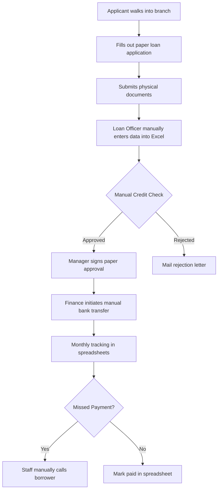
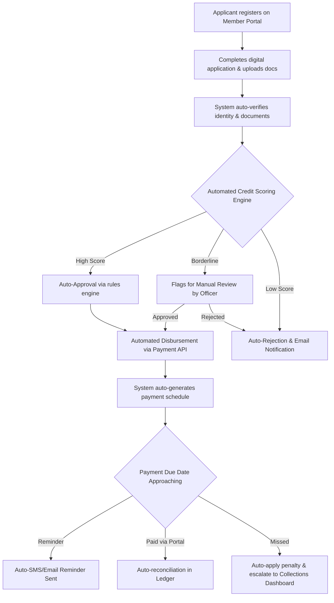
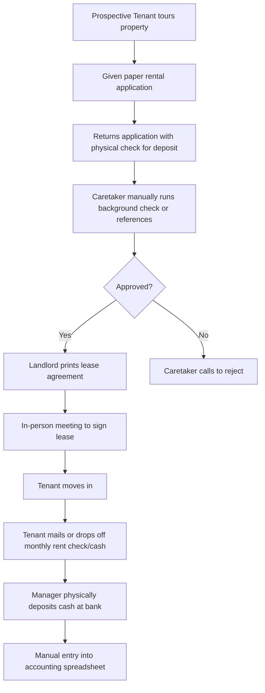
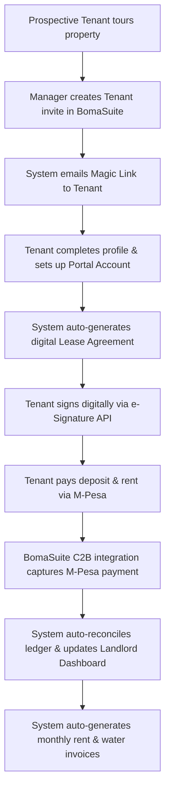

# SkyLution Workflow & SOP Samples

This repository contains real-world Standard Operating Procedures (SOPs), process maps, and client handover guides written for non-technical audiences. These documents are based on actual systems built for SkyLution clients, demonstrating the ability to translate complex technical workflows into actionable business operations documentation.

## Projects Included

### 1. TawiLend Loan Management System
A comprehensive SaaS platform for microfinance institutions to manage loan originations, approvals, and servicing.

**Deliverables:**
- [Standard Operating Procedure (SOP) / Runbook](./TawiLend/SOP_Runbook.md)
- [Client Handover Guide](./TawiLend/Client_Handover_Guide.md)

**Process Maps:**

*Current-State Process Map (Manual Process)*

*Future-State Workflow (Automated System)*

---

### 2. SkyLution Property Management System (BomaSuite)
An automated system for real estate managers to handle tenant onboarding, rent collection, and maintenance requests.

**Deliverables:**
- [Standard Operating Procedure (SOP) / Runbook](./BomaSuite/BomaSuite_SOP_Runbook.md)
- [Client Handover Guide](./BomaSuite/BomaSuite_Client_Handover_Guide.md)

**Process Maps:**

*Current-State Process Map (Manual Process)*

*Future-State Workflow (Automated System)*

