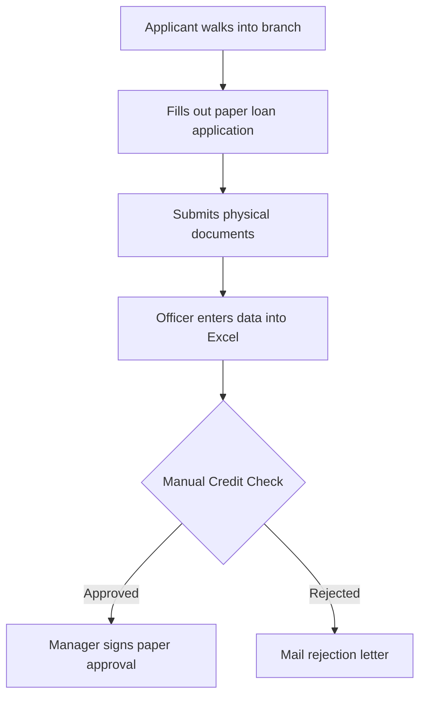
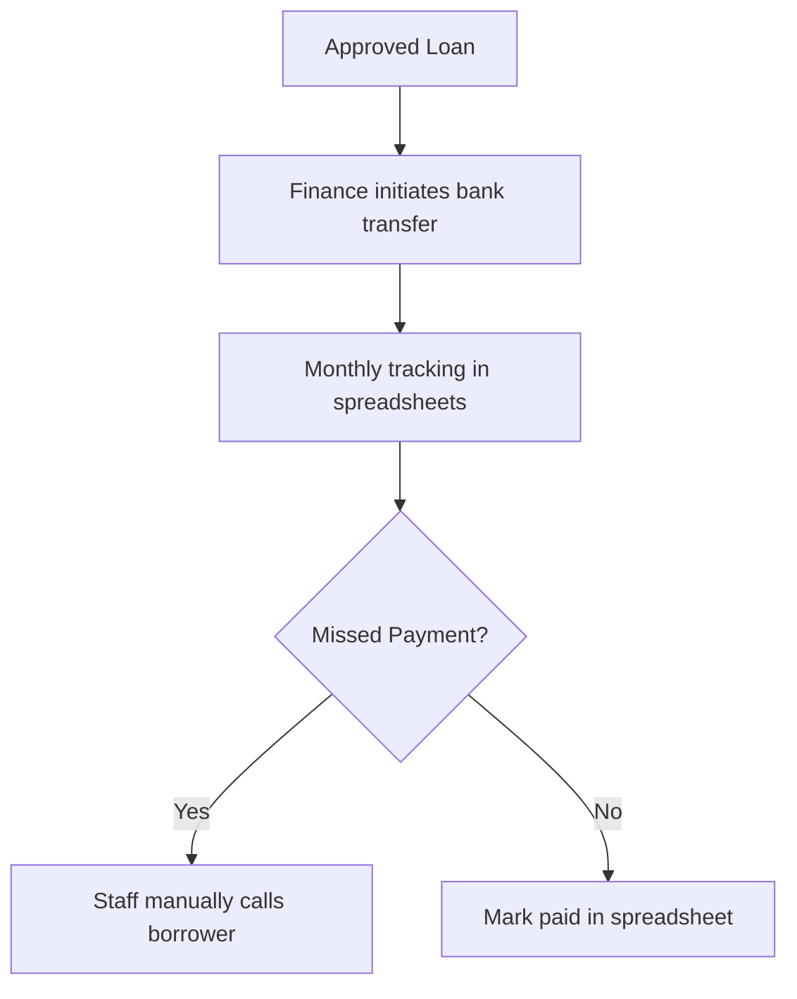
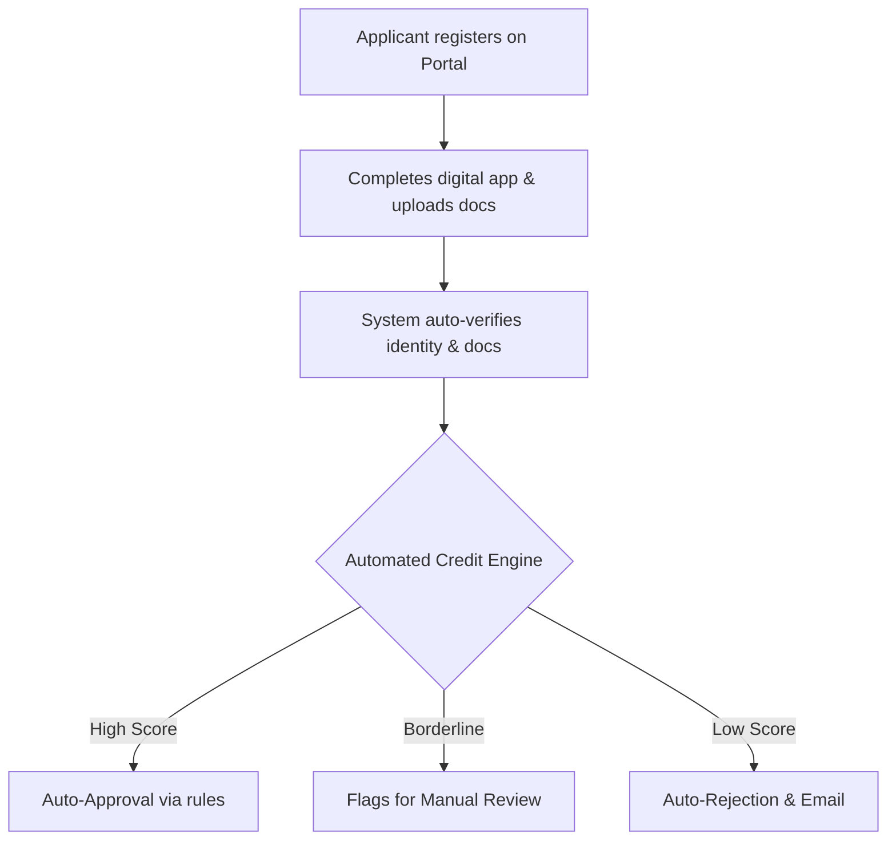
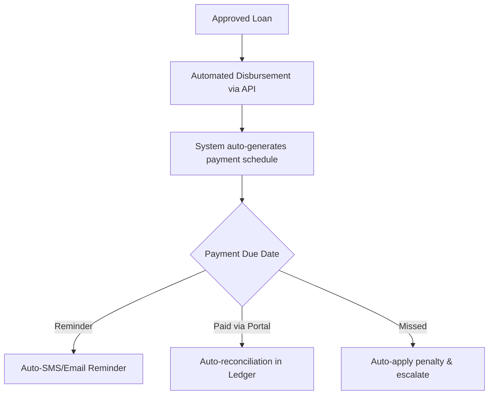

# Process Maps: TawiLend Loan Management System

## Current-State Process (Manual Workflow)

### Phase 1: Intake & Approval
*In the legacy manual process, loan applications were heavily dependent on physical paperwork, manual data entry, and physical signatures.*

### Phase 2: Disbursement & Servicing
*Once approved, disbursement required manual bank transfers, and tracking payments relied entirely on manual updates to a master spreadsheet.*

## Future-State Process (Automated System)

### Phase 1: Digital Intake & Automated Underwriting
*The new system provides a self-service portal for applicants and automates identity verification and initial credit scoring.*

### Phase 2: Automated Disbursement & Servicing
*Approved loans are disbursed automatically via API, and the system handles payment scheduling, reminders, and collections tracking.*

